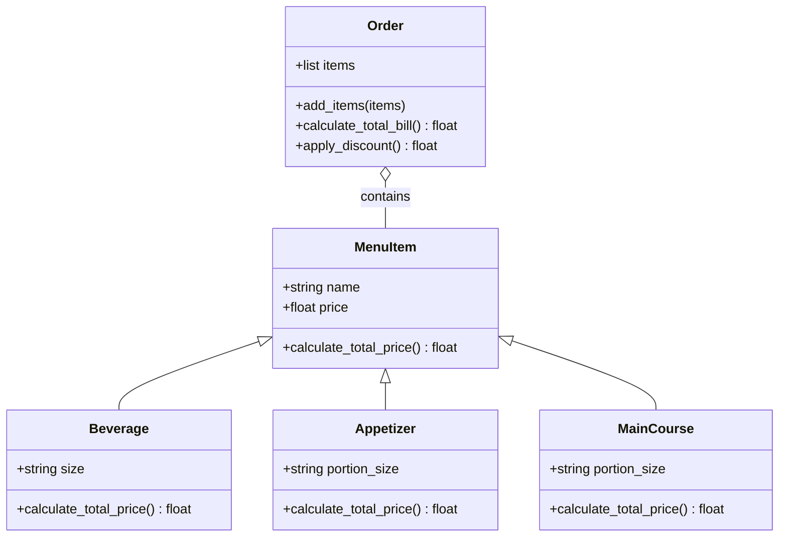

# Reto_03_POO

## 1. Create a repo with the class exercise

```python
import math

class Point:
    def __init__(self, x, y):
        self.x = x
        self.y = y

class Line:
    def __init__(self, start, end):
        self.start = start
        self.end = end

    def compute_length(self):
        return math.sqrt((self.end.x - self.start.x) ** 2 + (self.end.y - self.start.y) ** 2)

    def compute_slope(self):
        if self.end.x == self.start.x: 
            return math.inf
        else:
            return (self.end.y - self.start.y) / (self.end.x - self.start.x)
    
    def compute_horizontal_cross(self):
        if self.start.y == self.end.y: 
            return None  
        slope = self.compute_slope()
        if slope != math.inf: 
            x_intercept = self.start.x - (self.start.y / slope)
            return x_intercept
        return None

    def compute_vertical_cross(self):
        if self.start.x == self.end.x: 
            if self.start.x == 0:  
                return None  
            return None  
        elif self.start.y == self.end.y:  
            return self.start.y 
        else:
            slope = self.compute_slope()
            y_intercept = self.start.y - slope * self.start.x
            return y_intercept

class Rectangle:
    def __init__(self, line1, line2, line3, line4):
        self.line1 = line1
        self.line2 = line2
        self.line3 = line3
        self.line4 = line4


# Ejemplo de uso

p1 = Point(0, 0) 
p2 = Point(4, 0) 
p3 = Point(4, 3)  
p4 = Point(0, 3)  

line1 = Line(p1, p2) 
line2 = Line(p2, p3)  
line3 = Line(p3, p4) 
line4 = Line(p4, p1)

rectang = Rectangle(line1, line2, line3, line4)

print(f"Longitud de la línea 1: {line1.compute_length()}")

print(f"Pendiente de la línea 2: {line2.compute_slope()}")

print(f"Corte con el eje X (línea 3): {line3.compute_horizontal_cross()}")

print(f"Corte con el eje Y (línea 3): {line3.compute_vertical_cross()}")
```
Este código define tres clases: `Point`, `Line` y `Rectangle`. La clase `Point` representa un punto en el plano 2D con coordenadas \(x\) y \(y\). La clase `Line` tiene dos puntos, `start` y `end`, que definen el inicio y el final de la línea, respectivamente. Esta clase incluye tres métodos: `compute_length`, que calcula la longitud de la línea usando la fórmula de distancia euclidiana; `compute_slope`, que calcula la pendiente de la línea, devolviendo `math.inf` si la línea es vertical; y `compute_horizontal_cross`, que calcula el punto de intersección con el eje X (si la línea no es horizontal). El método `compute_vertical_cross` calcula la intersección con el eje Y, devolviendo el valor de \(y\) si la línea es horizontal o calculando la intersección con el eje Y para líneas no horizontales. Finalmente, la clase `Rectangle` toma cuatro líneas como parámetros, que se asume que forman un rectángulo.  
<br>

## 2. Restaurant scenario

```python
class MenuItem:
    def __init__(self, name, price):
        self.name = name
        self.price = price

    def calculate_total_price(self):
        return self.price

class Beverage(MenuItem):
    def __init__(self, name, price, size):
        super().__init__(name, price)
        self.size = size 

    def calculate_total_price(self):
        price_multiplier = {"Small": 1, "Medium": 1.2, "Large": 1.5}
        return self.price * price_multiplier.get(self.size, 1)

class Appetizer(MenuItem):
    def __init__(self, name, price, portion_size):
        super().__init__(name, price)
        self.portion_size = portion_size

    def calculate_total_price(self):
        portion_multiplier = {"Single": 1, "Double": 2} 
        return self.price * portion_multiplier.get(self.portion_size, 1)

class MainCourse(MenuItem):
    def __init__(self, name, price, portion_size):
        super().__init__(name, price)
        self.portion_size = portion_size 

    def calculate_total_price(self):
        price_multiplier = {"Small": 1, "Regular": 1.5, "Large": 2}
        return self.price * price_multiplier.get(self.portion_size, 1)

class Order:
    def __init__(self):
        self.items = []  

    def add_items(self, items):
        for item in items:
            if isinstance(item, MenuItem): 
                self.items.append(item) 
                
    def calculate_total_bill(self):
        total = sum(item.calculate_total_price() for item in self.items)
        return total

    def apply_discount(self):
        total = self.calculate_total_bill()
        if len(self.items) > 5:
            total *= 0.9  # 10% discount
        return total


# Ejemplo de uso

beverage1 = Beverage("Coke", 2.5, "Medium")
beverage2 = Beverage("Pepsi", 2.3, "Large")
beverage3 = Beverage("Lemonade", 3.0, "Small")
beverage4 = Beverage("Water", 1.5, "Medium")

appetizer1 = Appetizer("Spring Rolls", 4.0, "Single")
appetizer2 = Appetizer("French Fries", 3.5, "Double")
appetizer3 = Appetizer("Nachos", 5.0, "Single")
appetizer4 = Appetizer("Burrata", 5.5, "Double")

main_course1 = MainCourse("Spaghetti", 12.0, "Regular")
main_course2 = MainCourse("Pizza", 15.0, "Large")
main_course3 = MainCourse("Burger", 10.0, "Small")
main_course4 = MainCourse("Steak", 20.0, "Regular")

order = Order()
order.add_items([beverage1, beverage2, beverage3, beverage4, appetizer1, appetizer2, appetizer3, appetizer4,
                 main_course1, main_course2])

total_bill = order.calculate_total_bill()
print(f"Total Bill: ${total_bill:.2f}")

total_after_discount = order.apply_discount()
print(f"Total after 10% discount: ${total_after_discount:.2f}")
```

Este código define un sistema para gestionar un menú de restaurante y calcular el total de la factura de una orden. La clase `MenuItem` es la clase base para los elementos del menú, que tiene un nombre, un precio y un método `calculate_total_price()` que simplemente devuelve el precio del artículo. Luego, hay tres subclases de `MenuItem` que representan tipos específicos de platos del menú: `Beverage` (bebidas), `Appetizer` (entrantes) y `MainCourse` (platos principales). Cada una de estas subclases tiene su propia lógica para calcular el precio total, que varía según el tamaño o la porción. Por ejemplo, en `Beverage`, el precio se multiplica por un factor dependiendo del tamaño de la bebida (Pequeño, Mediano, Grande), mientras que en `Appetizer` y `MainCourse`, el precio cambia según el tamaño de la porción (individual o doble, pequeño, regular, o grande). La clase `Order` maneja la colección de los artículos del menú que el cliente agrega a su pedido. El método `add_items()` agrega una lista de artículos al pedido, siempre y cuando sean instancias de `MenuItem`. El método `calculate_total_bill()` suma los precios de todos los elementos del pedido, y el método `apply_discount()` aplica un descuento del 10% si hay más de 5 elementos en el pedido.  
<br>

### Diagrama

